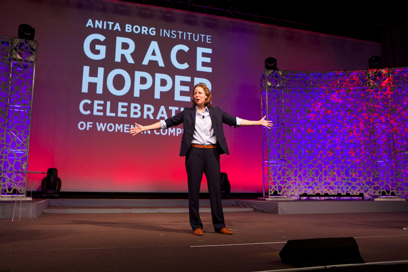

# Keynote Speaker
##Megan Smith
## Chief Technical Officer of the United States

>"First just wanna reflect on this culture shift...
>
>it's been a long time coming.
>
>I remember when the president reflecting...
>on the things Elizabeth Cady Stanton said.
>
>We are on a path that is unstoppable.
>...
>We the techies are part of that.
>
>We need to keep demanding and pushing."

She spoke about how women played an important role
in the history of Computer Science, saying that
sexism is "not the original heritage" of the technology
industry. She mentions the achievements of women
and teams of women in this field;

>"Often teams are the ones that do such extraordianry things
if you look at such old histic photos,
it's the women, the people of color...
we weren't included in the history.
>
>We're getting our history back,
>which is awesome.
>
>I'm hopeful.
>The tech industry ...
>If we see the problem we can debug it.
>thats how we roll."

>"The actual job of the CTO
>is to advise the president and his team
>on how to unleash the power of technology.
>
>I report to the president...
>so we're embedded .. with other innovation teams.
>... We work together.

She highlighted three things that she is focused on:
 * "tech policy", including broadband, privacy, helping fix "connectivity deserts", etc.
 * "this goverment itself - how are we gonna be better" using technology
>"We need all of us ...
>not only the digital core ...
>those of us who are putting 100% of our time
>... but also a digital reserves
>... many companies are already signing up for that
>... and the digital council.
 * "the american people ... innovation nation that we are"
>"I reflect on two Americas ...
>
>The America we live in ...
>
>exciting
>
>vibrant
>
>... and the second America ...
>
>that is stuck
>
>that can't see that
>
> [a] group of people making 10k per year
>now can add in task rabbit, elance ...
>adding 2,3,4k per year ...
>can really make a difference."

Her closing story was moving:
>"I'll end with an image for you
>of something I got to do earlier this year
>in Nigeria
>...
>It's in those deserts of connectivity ..."

She spoke about the young girls who had been kidnapped. The idea that people living in the "deserts of connectivity" are at risk, and that "people can do terrible things to them."

>"Let's work together to change that."

---

All images and quotes fall under [fair use][fair-use] and are intended for purely educational purposes.

This document is licensed under a [Creative Commons Attribution 3.0 United States (CC By 3.0 US) License][cc-by-3].
[fair-use]: http://en.wikipedia.org/wiki/Fair_use
[cc-by-3]: https://creativecommons.org/licenses/by/3.0/us/

---
