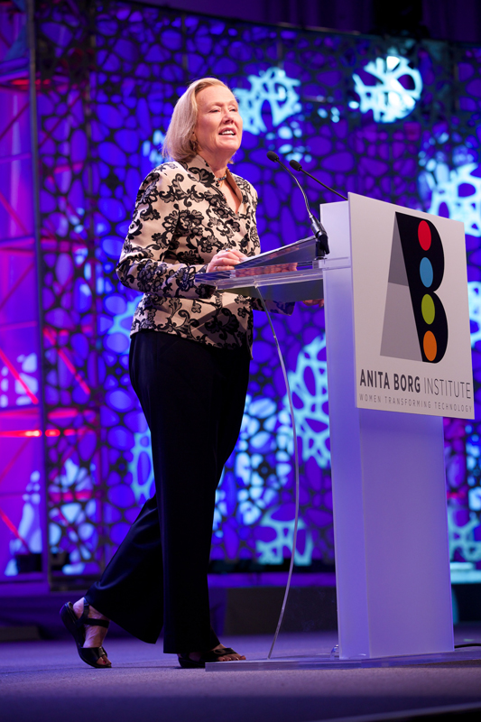
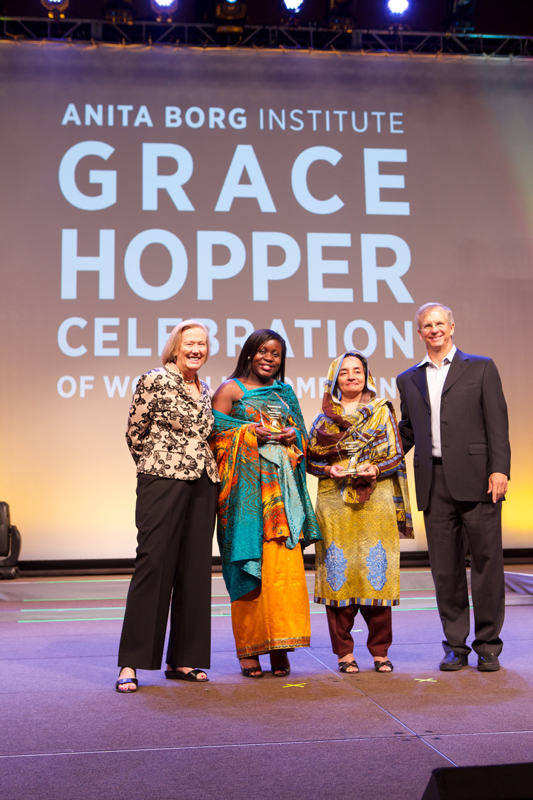
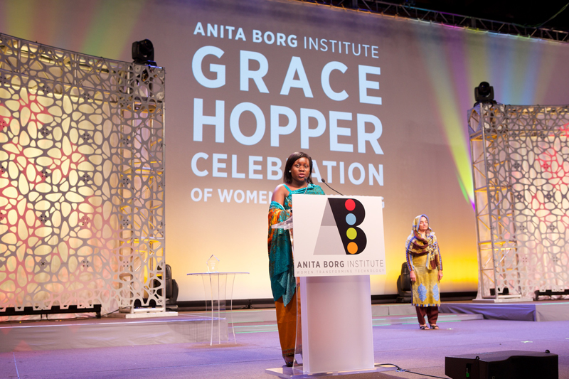

# Commencement
## Telle Whitney
###President and CEO of the Anita Borg institute

*image from [Grace Hopper Gallery 1][ghc-gallery-1]*

[ghc-gallery-1]: http://gracehopper.org/galleries/gallery-one/

>"20 years ago my friend Anita Borg convinced me we could put together
>a conference to celebrate women in computing"

She went on, saying that today we are "8000 strong".

>"[We are here because of the]
>hope that the field of computer science might actually
>become a true meritocracy."

>"[There is] a long way to go ..."

>"Major companies releasing their numbers ... it's not good -
>But they talked about it. [That's] really important."

>"All of us can agree that the numbers need work.
>Making these numbers public is an important step forward."

>###"Transparency drives commitment."

She quoted;
>>"While none of us may create the situation, all of us have a stake in fixing it."
-Megan Smith, CTO of USA

>"[The solution] involves all of you pursuing your dreams in technology
>.. mentoring others
>.. digging in when things don't go quite the way you have planned."

>###"Go for it, and don't take 'no' for an answer."

>"[The solution] also requires the participation and advocacy of men. ...
>[Men can] speak out when they see actions or words that are inappropriate. ...
>[We also need help from] ... Academic institutions ...
> ... Companies to examine their culture to eliminate bias ..."

>###"Recognize diversity drives innovation."

>"When we limit who can contribute, we limit our ability to solve the
>world's technical challenges."

>###"Let's all aspire to change the ratio and make technology for everyone, everywhere."

##Alexander Wolf
### ACM President

*image from [Grace Hopper Gallery 1][ghc-gallery-1]*

[ghc-gallery-1]: http://gracehopper.org/galleries/gallery-one/

>"ACM has been an important partner to the Anita Borg Institute ..."

>"Anita Borg had many years of a deep relationship with the ACM."

>"ACM has been committed for many decades to seeing women enter ... [and] ... stay in computing."

They are a partner of [code.org][code-dot-org], promoting international hour of code.

[code-dot-org]: http://code.org/

He gave examples of the
>" ... glaring and, i would say debilitating, rift ...
> ... In science and engineering ...
> ... In goverment ...
> ... Challenges and opportunities that do not know national boundaries ...
> ... In India women face fierce social pressures to abandon their careers
> to provide full time ... [for their] families. ...
> Their ability to remain in that workforce is severely limited.
> In Europe, ... [we are] developing programs for women in computing ...
> [The] inaugural Women Courage event in Manchester ...
> will be followed up next year in Sweden ...
> GHC is designed to have multiple opportunities to interact with inspiring women."

He introduced the other guest speakers beautifully.

>"We welcome those who have come to join in this celebration.
>Thank you, and enjoy the conference."

Telle Whitney chimed in again;
"Over the next three days you will meet our ABIE award winners"

## 2014 Change Agent ABIE Winners

*image from [Grace Hopper Gallery 1][ghc-gallery-1]*

[ghc-gallery-1]: http://gracehopper.org/galleries/gallery-one/

*Winners include Barbara Birungi and Durdana Habib*

### Barbara Birungi

*image from [Grace Hopper Gallery 1][ghc-gallery-1]*

[ghc-gallery-1]: http://gracehopper.org/galleries/gallery-one/

>"I have always been passionate about technology ...
>###My motivation... are the young women who I work with
>###who look at me with eyes that say
>>###"Wow - she can do anything"
>### - If Barbara can, then I can too"

>"Receiving this award is like a pat on my back from a big sister
> saying
>>"Keep it up""

>"I dream of a day
> such that when my daughter and your daughter grow up
> they will not face the challenges we have ...

>###It is possible, one girl or women at a time"

>"What every women in tech needs to do
> get on the road and move"

>"My work would also not be possible without
> my husband and children ...
> my mentor ..."

>"To all the women and men working towards making this issue history;
> Thank you."

### Durdana Habib
>"I am greatly humbled and honored ...
>offer sincerest gratitude ...
>I thank God for giving me the strength and ability ...
> I did not make this journey alone;
> numerous people have helped me along the way ...
> [my] family valued education
> [my] father extended full support, and this came at a time when
> there were rarely any female students enrolled in engineering programs."

> "[I] forced my way into industry ...
> working in an all male environment had it's challenges ...
> balancing work [and] home life was a challenge ..."

She was able to
>"connect with other woman in engineering through international women in engineering conferences."

She said they also
>"had informal meetups to share our problems ...
> that helped a lot."

> "My children saw me work through my PhD while in college ...

> "My daughter, an electrical engineer, is here as a GCH scholar."

She emphasized one more time "how grateful I am."
> "Thank you everyone."

##Winner of social impact award

*presented by*

Debbie Byron, Chief H.R. officer at RMS (Risk Management Solutions)

*image from [rms.com profile of Debbie Byron][rms-exec-team]*

[rms-exec-team]: http://www.rms.com/about/leadership/executive-team#debbie-byron

They introduced Ruthe as chief strategy and growth officer at NCWIT
(National Center for Women In Technology).

>"Over past 6 years, [she] has grown it from serving 32 women to a national talent pipeline
> ... [including] all ages."

>"Using social media and web technology, it has become a
> unique vibrant community and a professional network
> for young women."

##Ruthe Farmer
### Winner of the Social Impact Award
She began by saying "Thanks everyone", and
talking of her hope for a world where any girl can feel that
>" ... her abilities and interests have value
> ... her accomplishments have merit ..."

>" [where] technical women are not outliers, or rare birds ...
> ... [where] others know the value of the first 'hello world' ..."

She said that her work
>" makes me smile every day ...
> [seeing the girls] share support and encourage each other,
> even start companies together (5 of them),
> ... stop imposter syndrome in it's tracks."

>###"There is a legion of women heading your way who will be negotiating their salaries - so please budget accordingly."

>"There are countless partners that contribute
>more than 1k volunteers ...
> working together to encourage women early in their path.
> We should all be very proud of what we've achieved ...
> it's getting bigger ...
> [we are] about to open our new collegiate award starting in January."

She wanted to close with a "call to action":

>###"Next time you witness a technical woman doing something great, don't keep it to yourself; Tell her.  Tell someone else about her."

>"Together we can .. shift the tide of women in technology.
>Thank you."

##Shafi Goldwasser
###Keynote speaker
#**WIP: Still formatting this section**
*(from here down has not been cleaned up)*
"Truly honored..."
"I knew Anita Borg only regret is she is not here to see it"
"She would be extremely proud"

"First conference I went to was berkeley, SF
full of fear, mostly full of excitement
being able to tell these people about my work"

"At the time it would be hard to imagine 8000 at a conference to computing
any 8k people, not just women

it's been a remarkable journey, .. theoretical cs is my field

we discovered a lot
tremendous impact on technology and science

computational lense - looking at sci. tech. through a computational view

different lense - cryptographic lense

from the point of view of a cryptographer

going back historically field fo crypt. is linked to breakthroughs in
cs and tech.

shannon and turing had strong links to crypt.

shannon was working on secrecy theory at the same time as...

turing ... has probably been better known as the breaker of the
enigma machine

These two figures ... they were motivated by the war effort

This is where my talk and my field depart - in modern day
didn't come about because of a war effort

there is going to be an opportunity here for economics
privacy concerns should be addressed

cryptog. today is not just about finding the bad guys

how to guart. correctness and privacy of information

three things:
 - modern crypt. is enabled surprising abilities that seem paradox.
 in the physical world
 - modern crypt. has ... been a catalyst for several breakthroughts in
 theoretical comp. sc.
 - developed a set of tools that are very impt. to the futur. of computing
 they will allow us to take advantage of the enormous data we have available,
 but also enable the basic right ot be left alone

 exciting time in the life of the field.

1 -
what abilitites?

 - can exchange secret messages over the internet without ever meeting each other
 (public key crypt.)
 - sign contracts over the internet
 - prove a theorum w/o actually revealing the proof
 - play digital games on the computer
 - request information from db.s in privacy
 - computer unencrypted data (obfuscation methods)

 they seem like they are impossible, but they are possible

 there is something in common
 unifying things for all of these bullets I listed ...
 is there is a presence of an Adversary

 usually in algorithms they talk about Adversary

 in crypt. there is no adversary there is no problem

 The Adversary is there and he defines the problem

 You have to think about who the adversary is,
 but in all of these things...

 Who this adversary is not only defines the problem, but
 determines the quality of what se accept as a solution.

 is very important viewpoint
 key to analyzing a complex system
 the only way to argue that a system works well,
 is to argue it works well in the presence of an adversary

 so how powerful is the adversary

 I'd like to say we make no assumptions
 we do assume the adversary is computationally bounded
 bounded in time

 we can do all those things
 for such an enemy we can achieve all these paradoxically seeming things

 We say that it's ok to think that the adversary is computationally bounded
 because that is realistic

 we can realize a lot more by realizing the adv. is a compt. bounded device

 flavor of how we crypt. think

 two axis

 first axium - If we think about the adv. as someone sitting behind a screen
 adv. presses a button, and when he presses a button he gets a sample

 he's trying to figure out which distribution he's getting a sample from

 when you want to generate pseudorandom numbers
 generate sequences that seem random

 how do you define something like that

 two spaces
 one is random and one is pseudo random
 as long as noone in bounded amt of time, can tell which is which

 when you cannot disting. betw. two things, they are essentially as good as each other

second axium - if you can simulate you might as well stay home

if he can simulate it on his computer and he would not have learned any more than really interacting with you
  then it is safe

 notions of security

2-
cryptography has been a catalyst for some great inventions

classical proofs
provers

incredibly smart
came up with these proofs
we could think of how my son write geometry proofs for high school

today we're going to talk about different kind of proofs

now I want to think of a proof as an interaction

prover on the left
on the side is someone else

what's an example of something you want to prove
this equation is correct

Namely - there is a solution to the equation that makes it true

Is there any other way?

I want to hide something from you

Yes there is a way
the idea is that this prover
she is not going to give you the solution to the eq.
she is going to prove to you that she could if she wanted to

this is mathematics
it does have something to do with cryptography
the way I prove that I am the right person
is I show that I can solve the equation

we're going to need new ingredients
randomness
ability to talk back and forth

get out of the old paradigm of classical proofs

prover .. she will write down a special kind of proof
that will ahve two parts
if you know two parts you can reconstruct the solution
  if you have one part you can't get it
if he catches you that you can't do the first or the second
there is a probablity that he would have asked for the part
you have when you don't have the other part

0 knowledge interactive proofs
new proof system
we have some guarantees

if the theorum is correct
  the verifier will accept
if the theorum is incorrect
  the verifier will usually not accept
0 knowledge gained by verifier

small probability of error
it should convince you of incorrect statements
at the end you know nothing except that it is correct

maybe you can prove more theorums
maybe there are some statements that you can now convince me quickly of

How in a classical proof can you show that there is no solution to an equation?

You might want to check that there are exactly 2^13 solutions
that's too much to write down

It is possible that the verifier can verify in compt. bounded time
all of these things

What's beautiful about this field is - you decide.

That's my one big advice - you have to decide.

Arrival of 2nd prover
can check consistently
provers can get caught if they deviate
proofs as a method of checking alibis

this model is even more powerful than a single prover
You can check statements that are even harder than a single prover

we have today new ways to write proofs in a book
so that you can check the correctness of this proof
with only checking in a few places

Now, the most exciting part:

What about the future?
The role that they can play in the future
up til now it was history
now it's present and future

used to have desktops
lots of local storage, local computing
computers have gotten smaller
cloud has gotten much larger
migration of data
all that data that was local is migrating to the cloud
migration of computation
it's not been done but it will be done
you can just use it as a resource
the analogy of turning on the faucet, and water comes out

in addition to that,
there is a lot of data that has been collected on us
all these sponsors
they are storing a lot of information on us
surveillance photos
purchasing history
social interactions
medical records

one can find out a lot of information
that could help our health
one could discover things about diseases we didn't know
national security

but there's also risks
enourmous risks
lots of control that is taken out of our hands

the computer is not in our office

misuse of knowledge
is inevitable or at least possible

loss of control
loss of privacy
loss of fairness

Benefit vs. Risk
can mathematics and tech. help us to have the best of both worlds

we can, to a large extend, with the help of some sort of regulation,
get the benefits without so much of the risks

the magic of cryptography

send my data to the cloud and they run the program

why do we trust the cloud?

the idea is essentially is... we force the cloud to send us the results
plus a proof that the program was run correctly
we want to verify much harder statements in much shorter time

how can you make... proofs that are super efficient to verify

the cloud doesn't take too much time to prove it

2nd challenge
there's the cloud...
the data is very sensitive
do you really want to give this to the cloud?

  so we encrypt
  I store it encrypted
  before they could compute on it
  even though you don't see the data, how can you compute on it?

  this is one of the biggest results
  you can actually run programs on encrypted data
  they give you back the result encrypted

All you have to do is encrypt you data and decrypt the result
has gone through a lot of rapid development in the last 5 years
theory to practice has taken place

it will be there in the next few years

[Gentry09]

sigh of relief

What we'd like is, somehow, to extract some information about the data

let's think about surveillance
imagine a situation where all the surveillance where all the cameras
would produce encrypted photos

they will have to know if there is suspicious behavior in those photos

even though you can't see anything in the photos, you need to be able
to compare to the suspect database.

What we'd like is just to know the result
without knowing the sequence itself

This is another kind of encryption scheme that people have invented
functional encryption

**Functional Encryption**
key-pair program
every item has a key
it just checks for the one key

it can be done
question is what is the efficienty of these schemes

Last challenge

we know how to hide your data
we know how to give permission to run certain programs

a bunch of computers that want to share data
but they don't
they want to compute some program on all the inputs
without telling others what their inputs are

Example:
financial industry
All these banks
they have a lot of data
assess the global solvency
is there a way for them to talk to each other so they will know
the threat level of the banks collapsing without sharing their data

Hospitals
answer the research problems they are interested in without sharing their data

Very old stuff, from the 80's, they can talk to each other and get the result
without showing each other the data

There are a lot of big questions on the table about this

I just want to give two bullet points

What should you remember from this talk?
 * Whatever intuition we have about what is possible should not constrain our
 expectation for what is possible
 * Challenges for the future of computer science is to think of new representations of data
 this is the new way to think.

All images and quotes fall under [fair use][fair-use] and are intended for purely educational purposes.

This document is licensed under a [Creative Commons Attribution 3.0 United States (CC By 3.0 US) License][cc-by-3].
[fair-use]: http://en.wikipedia.org/wiki/Fair_use
[cc-by-3]: https://creativecommons.org/licenses/by/3.0/us/
