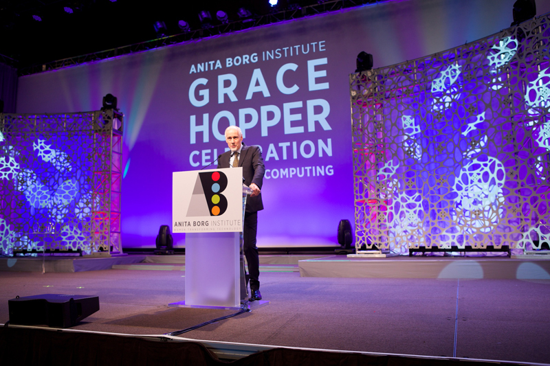
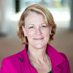
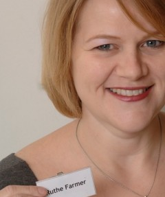

# Commencement
## Telle Whitney
###President and CEO of the Anita Borg institute

*image from [Grace Hopper Gallery 1][ghc-gallery-1]*

[ghc-gallery-1]: http://gracehopper.org/galleries/gallery-one/

>"20 years ago my friend Anita Borg convinced me we could put together
>a conference to celebrate women in computing"

She went on, saying that today we are "8000 strong".

>"[We are here because of the]
>hope that the field of computer science might actually
>become a true meritocracy."

>"[There is] a long way to go ..."

>"Major companies releasing their numbers ... it's not good -
>But they talked about it. [That's] really important."

>"All of us can agree that the numbers need work.
>Making these numbers public is an important step forward."

>###"Transparency drives commitment."

She quoted;
>>"While none of us may create the situation, all of us have a stake in fixing it."
-Megan Smith, CTO of USA

>"[The solution] involves all of you pursuing your dreams in technology
>.. mentoring others
>.. digging in when things don't go quite the way you have planned."

>###"Go for it, and don't take 'no' for an answer."

>"[The solution] also requires the participation and advocacy of men. ...
>[Men can] speak out when they see actions or words that are inappropriate. ...
>[We also need help from] ... Academic institutions ...
> ... Companies to examine their culture to eliminate bias ..."

>###"Recognize diversity drives innovation."

>"When we limit who can contribute, we limit our ability to solve the
>world's technical challenges."

>###"Let's all aspire to change the ratio and make technology for everyone, everywhere."

##Alexander Wolf
### ACM President

*image from [Grace Hopper Gallery 1][ghc-gallery-1]*

[ghc-gallery-1]: http://gracehopper.org/galleries/gallery-one/

>"ACM has been an important partner to the Anita Borg Institute ..."

>"Anita Borg had many years of a deep relationship with the ACM."

>"ACM has been committed for many decades to seeing women enter ... [and] ... stay in computing."

They are a partner of [code.org][code-dot-org], promoting international hour of code.

[code-dot-org]: http://code.org/

He gave examples of the
>" ... glaring and, i would say debilitating, rift ...
> ... In science and engineering ...
> ... In goverment ...
> ... Challenges and opportunities that do not know national boundaries ...
> ... In India women face fierce social pressures to abandon their careers
> to provide full time ... [for their] families. ...
> Their ability to remain in that workforce is severely limited.
> In Europe, ... [we are] developing programs for women in computing ...
> [The] inaugural Women Courage event in Manchester ...
> will be followed up next year in Sweden ...
> GHC is designed to have multiple opportunities to interact with inspiring women."

He introduced the other guest speakers beautifully.

>"We welcome those who have come to join in this celebration.
>Thank you, and enjoy the conference."

Telle Whitney chimed in again;
"Over the next three days you will meet our ABIE award winners"

## 2014 Change Agent ABIE Winners

*image from [Grace Hopper Gallery 1][ghc-gallery-1]*

[ghc-gallery-1]: http://gracehopper.org/galleries/gallery-one/

*Winners include Barbara Birungi and Durdana Habib*

### Barbara Birungi

*image from [Grace Hopper Gallery 1][ghc-gallery-1]*

[ghc-gallery-1]: http://gracehopper.org/galleries/gallery-one/

>"I have always been passionate about technology ...
>###My motivation... are the young women who I work with
>###who look at me with eyes that say
>>###"Wow - she can do anything"
>### - If Barbara can, then I can too"

>"Receiving this award is like a pat on my back from a big sister
> saying
>>"Keep it up""

>"I dream of a day
> such that when my daughter and your daughter grow up
> they will not face the challenges we have ...

>###It is possible, one girl or women at a time"

>"What every women in tech needs to do
> get on the road and move"

>"My work would also not be possible without
> my husband and children ...
> my mentor ..."

>"To all the women and men working towards making this issue history;
> Thank you."

### Durdana Habib
>"I am greatly humbled and honored ...
>offer sincerest gratitude ...
>I thank God for giving me the strength and ability ...
> I did not make this journey alone;
> numerous people have helped me along the way ...
> [my] family valued education
> [my] father extended full support, and this came at a time when
> there were rarely any female students enrolled in engineering programs."

> "[I] forced my way into industry ...
> working in an all male environment had it's challenges ...
> balancing work [and] home life was a challenge ..."

She was able to
>"connect with other woman in engineering through international women in engineering conferences."

She said they also
>"had informal meetups to share our problems ...
> that helped a lot."

> "My children saw me work through my PhD while in college ...

> "My daughter, an electrical engineer, is here as a GCH scholar."

She emphasized one more time "how grateful I am."
> "Thank you everyone."

##Winner of social impact award

*presented by*

Debbie Byron, Chief H.R. officer at RMS (Risk Management Solutions)

*image from [rms.com profile of Debbie Byron][rms-exec-team]*

[rms-exec-team]: http://www.rms.com/about/leadership/executive-team#debbie-byron

They introduced Ruthe as chief strategy and growth officer at NCWIT
(National Center for Women In Technology).

>"Over past 6 years, [she] has grown it from serving 32 women to a national talent pipeline
> ... [including] all ages."

>"Using social media and web technology, it has become a
> unique vibrant community and a professional network
> for young women."

##Ruthe Farmer
### Winner of the Social Impact Award

*image from [ncwit.org profile of Ruthe Farmer][ncwit-ruthe]*

[ncwit-ruthe]: http://www.ncwit.org/profile/ruthe-farmer

She began by saying "Thanks everyone", and
talking of her hope for a world where any girl can feel that
>" ... her abilities and interests have value
> ... her accomplishments have merit ..."

>" [where] technical women are not outliers, or rare birds ...
> ... [where] others know the value of the first 'hello world' ..."

She said that her work
>" makes me smile every day ...
> [seeing the girls] share support and encourage each other,
> even start companies together (5 of them),
> ... stop imposter syndrome in it's tracks."

>###"There is a legion of women heading your way who will be negotiating their salaries - so please budget accordingly."

>"There are countless partners that contribute
>more than 1k volunteers ...
> working together to encourage women early in their path.
> We should all be very proud of what we've achieved ...
> it's getting bigger ...
> [we are] about to open our new collegiate award starting in January."

She wanted to close with a "call to action":

>###"Next time you witness a technical woman doing something great, don't keep it to yourself; Tell her.  Tell someone else about her."

>"Together we can .. shift the tide of women in technology.
>Thank you."

##Shafi Goldwasser
###Keynote speaker

*image from [wikipedia profile of Shafi Goldwasser][wikiped-shafi]*

[wikiped-shafi]: http://en.wikipedia.org/wiki/Shafi_Goldwasser

She began by saying she was "truly honored...";

>"I knew Anita Borg only regret is she is not here to see it ...
>She would be extremely proud."

>"The first conference I went to was ... [in] Berkeley, San Francisco..
> [I was] full of fear, mostly full of excitement ...
> being able to tell these people about my work."

>"At the time it would be hard to imagine 8000 at a conference on computing;
> Any 8k people, not just women."

> "It's been a remarkable journey ...
> Theoretical computer science is my field ...
> We discovered a lot ...
> [it has had a] tremendous impact on technology and science."

She introduced the idea of a "computational lens - looking at science and
technology through a computational view."

That led into the idea of a "different lens ... [a] cryptographic lens."

The cryptographic lens is a way of seeing things from the point of view of a cryptographer.

> "Going back historically the field of cryptography is linked to breakthroughs in
> computer science and technology."

> "Shannon and Turing had strong links to cryptography.
> Shannon was working on secrecy theory ...
> Turing ... has probably been better known as the breaker of the
> Enigma Machine.
> These two figures ... they were motivated by the war effort. ...
> This is where my talk and my field depart - in modern day
> ... [our understanding] didn't come about because of a war effort."

When talking about the motivations for modern research in this field, she said "there is going to be an opportunity here for economics".

> "Privacy concerns should be addressed. ...
>  Cryptography today is not just about finding the bad guys. ...
> How to guartantee correctness and privacy of information?"

To outline the rest of the lecture, she outlined three points:
 - Modern cryptography has enabled surprising abilities that seem paradoxical in the physical world
 - Modern cryptography has ... been a catalyst for several breakthroughs in theoretical computer science
 - [Cryptography has] developed a set of tools that are very important to the future of computing ... they will allow us to take advantage of the enormous data we have available, but also enable the basic right to be left alone

> "[It is an] exciting time in the life of the field."

### Suprising New Abilities
*what abilities?*

**We can:**
> -  Exchange secret messages over the internet without ever meeting each other (public key cryptography)
> -  Sign contracts over the internet
> -  Prove a theorum with out actually revealing the proof
> -  Play digital games on the computer
> -  Request information from databases in privacy
> -  Computer unencrypted data (obfuscation methods)

> "They seem like they are impossible, but they are possible."

>"There is something in common
> unifying things for all of these bullets I listed ...
> there is a presence of an Adversary."

>"Usually in algorithms they talk about Adversary ...
> in cryptography [if] there is no adversary there is no problem.
> The Adversary is there and he defines the problem.
> You have to think about who the adversary is,
> but in all of these things...
> Who this adversary is not only defines the problem, but
> determines the quality of what is accepted as a solution."

> "[It] is a very important viewpoint ...
> [The] key to analyzing a complex system ...
>  The only way to argue that a system works well
>  is to argue it works well in the presence of an adversary. ...
> So how powerful is the adversary? ...
> I'd like to say we make no assumptions. ...
> We do assume the adversary is computationally bounded ...
> Bounded in time ...
> We can do all those things ...
> For such an enemy we can achieve all these paradoxically seeming things. ...
> We say that it's ok to think that the adversary is computationally bounded
> because that is realistic.
> We can realize a lot more by realizing the adversary is a computationally bounded device."

She described this as a taste of the flavor of "how we cryptographers think".

She then proposed two axioms:

>"First axiom - If we think about the adversary as someone sitting behind a screen ...
> The adversary presses a button, and when he presses a button he gets a sample ...
> He's trying to figure out which distribution he's getting a sample from ...
> When you want to generate pseudo-random numbers;
> generate sequences that seem random ...
> How do you define something like that?
> [You can define it as] two spaces ...
> One is random and one is pseudo-random ...
> As long as no one in a bounded amount of time can tell which is which ...
>  When you cannot distinguish between two things, they are essentially as good as each other."

> "Second axiom - if you can simulate you might as well stay home.
> If he (the adversary) can simulate it on his computer and he would not have learned any more than really interacting with you
> then it is safe.""

### Notions of Security

"Cryptography has been a catalyst for some great inventions."

She started describing the concept of "classical proofs", where the "provesr" are
"incredibly smart ... [and] came up with these proofs."

> "We could think of how my son writes Geometry proofs for high school. ...
> ### Today we're going to talk about different kind of proofs. ...
> Now I want to think of a proof as an interaction ...
> Prover on the left ...
> On the side is someone else.
> What's an example of something you want to prove? ...
> This equation is correct.
> Namely - there is a solution to the equation that makes it true.
> Is there any other way? ...
> Yes there is a way. ...
> The idea is that this prover ...
> ### She is not going to give you the solution to the equation.
> ### She is going to prove to you that she could if she wanted to."

> "This is mathematics ...
> it does have something to do with cryptography.
> The way I prove that I am the right person ...
> is I show that I can solve the equation.
> We're going to need new ingredients;
> * randomness
> * the ability to talk back and forth"

> ###"Get out of the old paradigm of classical proofs."

>"[The] prover .. she will write down a special kind of proof
> that will have two parts.
> If you know two parts you can reconstruct the solution.
> If you have one part you can't get it.
> If he (the adversary) catches you that you can't do the first or the second ...
> There is a probability that he would have asked for the part
> you have when you don't have the other part."

In this "new proof system" of "zero knowledge interactive proofs ...
we have some guarantees".

> "If the theorum is correct
>  the verifier will accept.
>
>If the theorum is incorrect
>  the verifier will usually not accept.
>
> Zero knowledge gained by verifier."

>"[There is a] small probability of error;
>... it should convince you of incorrect statements ...
> at the end you know nothing except that it is correct."

In this new system of proofs,
> " ... maybe you can prove more theorums ...
> maybe there are some statements that you can now convince me quickly of."

> "How in a classical proof can you show that there is no solution to an equation?
>
> You might want to check that there are exactly 2^13 solutions ...
> That's too much to write down.
>
> It is possible that the verifier can verify in computationally bounded time
>all of these things."

>"What's beautiful about this field is - you decide.
> That's my one big advice - you have to decide."

She described what happens with the "arrival of 2nd prover ...
[you] can check consistently ...
provers can get caught if they deviate ...
proofs as a method of checking alibis."

>"This model is even more powerful than a single prover.
>You can check statements that are even harder than a single prover."

>"We have today new ways to write proofs in a book ...
> so that you can check the correctness of this proof
> with only checking in a few places.
> Now, the most exciting part:
> ### What about the future?
> ... The role that they can play in the future
> ... up til now it was history
> ... now it's present and future.

> "[We] used to have desktops ...
> ... lots of local storage, local computing
> ... computers have gotten smaller ...
> [the] cloud has gotten much larger.
> ... [the] migration of data ...
> All that data that was local is migrating to the cloud.
> ... migration of computation ...
> It's not been done but it will be done;
> You can just use it as a resource ...
> ... [like] the analogy of turning on the faucet, and water comes out.
> In addition to that,
> there is a lot of data that has been collected on us.
> All these sponsors ...
> they are storing a lot of information on us.
> * surveillance photos
> * purchasing history
> * social interactions
> * medical records (the list goes on)
> One can find out a lot of information ...
> that could help our health.
> One could discover things about diseases we didn't know ...
> [One could improve] national security. ...
> But there's also risks -
> enormous risks -
> lots of control that is taken out of our hands.
> The computer is not in our office. ...
> [The] misuse of knowledge is inevitable or at least possible."

> ###"Loss of control,
> ###Loss of privacy,
> ###Loss of fairness ..."

>"Benefit versus Risk ...
> ###Can mathematics and technology help us to have the best of both worlds?
> we can, to a large extent, *with the help of some sort of regulation*,
> get the benefits without so much of the risks."

> "The magic of cryptography ...
> [allows us to] send my data to the cloud and they run the program ...
> ### Why do we trust the cloud?
> the idea is essentially ... we force the cloud to send us the results ...
> plus a proof that the program was run correctly. ...
> We want to verify much harder statements in much shorter time.
> How can you make... proofs that are super efficient to verify?
> ... [so that] the cloud doesn't take too much time to prove it?
> [the] second challenge:
> There's the cloud...
> the data is very sensitive.
> ### Do you really want to give this to the cloud?
> So we encrypt ...
> I store it encrypted ...
> before they could compute on it ...
> even though you don't see the data, how can you compute on it?
> This is one of the biggest results ...
> *You can actually run programs on encrypted data.*
> They give you back the result encrypted.
> All you have to do is encrypt you data and decrypt the result. ...
> [It] has gone through a lot of rapid development in the last 5 years ...
> Theory to practice has taken place ...
> It will be there in the next few years.
> [It is a] sigh of relief."

> "What we'd like is, somehow, to extract some information about the data.
> Let's think about surveillance;
> Imagine a situation where all the surveillance where all the cameras
> would produce encrypted photos. ...
> They will have to know if there is suspicious behavior in those photos. ...
> Even though you can't see anything in the photos, you need to be able
> to compare to the suspect database. ...
> What we'd like is just to know the result
> without knowing the sequence itself. ...
> This is another kind of encryption scheme that people have invented -
> functional encryption.

###Functional Encryption
> "... [is a] key-pair program ...
> every item has a key ...
> it just checks for the one key. ...
> It can be done ...
> question is what is the efficiency of these schemes. ..."
> Last challenge:
> We know how to hide your data.
>
> We know how to give permission to run certain programs.
>
> A bunch of computers that want to share data
> but they don't.
> They want to compute some program on all the inputs
> without telling others what their inputs are.
>
> Example:
>
> [In the] financial industry all these banks ...
> they have a lot of data ...
> [they could use it to] assess the global solvency. ...
> Is there a way for them to talk to each other so they will know ...
> the threat level of the banks collapsing without sharing their data?"

Another example:
>"Hospitals [want to] ...
> answer the research problems they are interested in without sharing their data. ...
>
> [There is some] very old stuff, from the 80's ... they can talk to each other and get the result
> without showing each other the data. ...
> There are a lot of big questions on the table about this. ..."

She summarized her lecture thus:
> "I just want to give two bullet points
>
> What should you remember from this talk?
> ### * Whatever intuition we have about what is possible should not constrain our expectation for what is possible
> ### * Challenges for the future of computer science is to think of new representations of data this is the new way to think.

---

All images and quotes fall under [fair use][fair-use] and are intended for purely educational purposes.

This document is licensed under a [Creative Commons Attribution 3.0 United States (CC By 3.0 US) License][cc-by-3].
[fair-use]: http://en.wikipedia.org/wiki/Fair_use
[cc-by-3]: https://creativecommons.org/licenses/by/3.0/us/

---
[Official Notes on the Systers Wiki][opening-session-wiki]

[opening-session-wiki]: http://systers.org/wiki/communities/doku.php?id=wiki:ghc:ghc14:keynote_-_shafi_goldwasser
